# Laporan Modul 2: Dasar Pemrograman Java
**Mata Kuliah:** Desain Pattern  
**Nama:** MUHAMMAD RAYYAN ALFARISY
**NIM:** 2024573010118
**Kelas:** TI 2A

---

## 1. Abstrak
Modul 1 “Dasar Pemrograman Java” bertujuan untuk memperkenalkan konsep fundamental pemrograman dengan bahasa Java, meliputi variabel & tipe data, operasi input & output menggunakan Scanner, struktur kontrol percabangan, dan perulangan. Praktikum dilakukan dengan latihan langsung untuk mengimplementasikan teori melalui kode Java, diakhiri dengan analisa hasil dan refleksi pembelajaran.

---
## 2. Praktikum
### Praktikum 1 - Variabel dan Tipe Data
#### Dasar Teori
Variabel dan Tipe Data
Dalam bahasa Java, variabel adalah tempat untuk menyimpan data yang memiliki tipe tertentu. Java memiliki tipe data primitif seperti byte, short, int, long, float, double, boolean, dan char yang digunakan untuk menyimpan nilai sederhana. Selain itu terdapat juga tipe data referensi seperti String dan array yang digunakan untuk menyimpan data yang lebih kompleks. Penamaan variabel harus mengikuti aturan tertentu seperti tidak diawali angka, tidak menggunakan kata kunci Java, dan bersifat case sensitive. Pemahaman tentang tipe data dan variabel sangat penting karena menentukan bagaimana data dikelola dan diproses dalam program.
#### Langkah Praktikum
1.Buat package baru Praktikum_1 di dalam folder src.

2.Buat file Variable

3.Deklarasikan berbagai variabel dengan tipe data berbeda (misalnya int, double, boolean, char, String).

4.Cetak isi variabel ke konsol.
#### Screenshoot Hasil
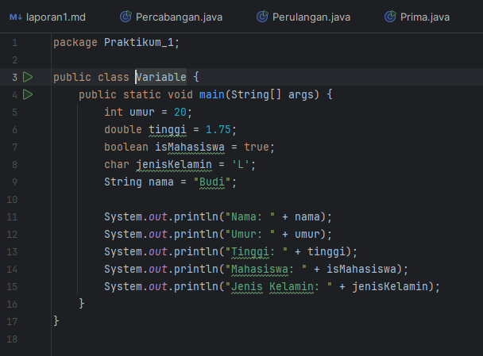

Latihan:
buat package baru di dalam praktikum_1 dengan nama latihan

buat file Variable

Buatlah program untuk menampilkan data diri anda yang lengkap dengan attribut seperti berikut:

Nama Lengkap, Tempat Lahir, Tanggal Lahir, Golongan Darah, Umur,
Tinggi Badan, Jenis Kelamin, Agama, Pekerjaan.

#### Screenshoot Hasil
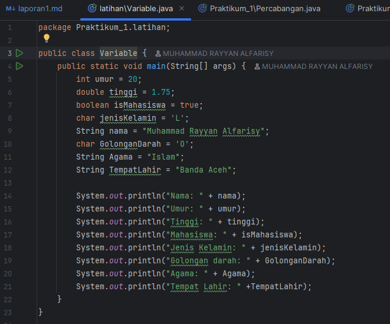

#### Analisa dan Pembahasan
Pada praktikum ini terlihat bahwa setiap tipe data di Java memiliki karakteristik dan batasan tertentu. Variabel bertipe int hanya dapat menyimpan bilangan bulat dalam rentang tertentu, sedangkan double dapat menyimpan angka desimal. Tipe data boolean hanya menampung nilai benar atau salah, dan char menyimpan satu karakter tunggal. Ketika program dijalankan, hasil output menunjukkan nilai setiap variabel sesuai dengan tipe data yang dideklarasikan. Percobaan ini memperkuat pemahaman bahwa pemilihan tipe data yang tepat penting agar program berjalan efisien dan tidak terjadi kesalahan saat pengolahan data.

### Praktikum 2 - Operator dan Expressi
#### Dasar Teori
Operator digunakan untuk melakukan operasi pada variabel dan nilai. Jenis operator:

Aritmatika: +, -, *, /, %

Perbandingan: ==, !=, >, <, >=, <=

Logika: && (AND), || (OR), ! (NOT)
#### Langkah Praktikum
1.Buat file operator

#### Screenshoot Hasil
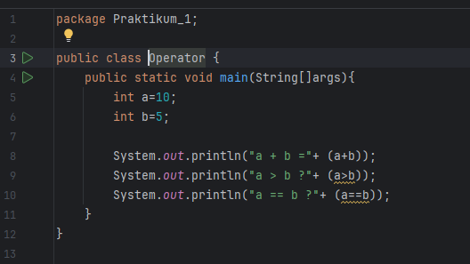

Latihan:

buat file Operator

#### Screenshoot Hasil
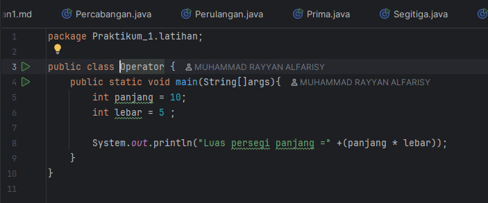
#### Analisa dan Pembahasan

### Praktikum 3 - Struktur Kontrol: Percabangan
#### Dasar Teori

Dalam praktikum ini digunakan struktur if–else dan switch untuk memproses keputusan berdasarkan kondisi tertentu. Hasil uji menunjukkan bahwa if–else cocok untuk kondisi kompleks dengan banyak logika, sedangkan switch lebih sederhana dan mudah dibaca untuk banyak pilihan yang terdefinisi jelas. 

        if (kondisi) {
        // Blok kode jika kondisi true
        } else {
        // Blok kode jika kondisi false
        }

        switch (variabel) {
        case nilai1:
        // Blok kode jika variabel == nilai1
        break;
        case nilai2:
        // Blok kode jika variabel == nilai2
        break;
        default:
        // Blok kode jika tidak ada case yang sesuai
        }
#### Langkah Praktikum

3.1 Eksperimen If–Else Sederhana

Buat file Percabangan

Jalankan program, amati output untuk beberapa input berbeda.
#### Screenshoot Hasil
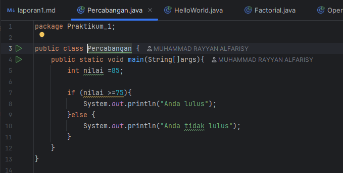

3.2 Latihan
Buat file Percabangan

Tulis program untuk mengecek apakah angka yang dimasukkan pengguna adalah bilangan genap atau ganjil.

Jalankan program, amati output untuk beberapa input berbeda.

#### Screenshoot Hasil
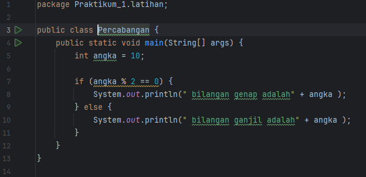
#### Analisa dan Pembahasan
Dalam praktikum ini digunakan struktur if–else dan switch untuk memproses keputusan berdasarkan kondisi tertentu. Hasil uji menunjukkan bahwa if–else cocok untuk kondisi kompleks dengan banyak logika, sedangkan switch lebih sederhana dan mudah dibaca untuk banyak pilihan yang terdefinisi jelas. Program grade menunjukkan hasil berbeda tergantung skor yang dimasukkan, dan menu switch berjalan lancar sesuai pilihan pengguna. Analisa ini menunjukkan pentingnya memilih struktur percabangan yang tepat agar kode lebih efisien, mudah dipelihara, dan hasil program sesuai harapan.

---
### Praktikum 4 - Struktur Kontrol: Perulangan
#### Dasar Teori
Perulangan adalah mekanisme untuk mengeksekusi blok kode secara berulang selama kondisi tertentu terpenuhi. Dalam Java terdapat tiga jenis perulangan utama yaitu for, while, dan do–while. Perulangan for biasanya digunakan ketika jumlah iterasi sudah diketahui, sedangkan while digunakan jika kondisi perlu diperiksa sebelum eksekusi blok kode. Do–while menjamin blok kode dijalankan minimal satu kali meskipun kondisi awal bernilai false. Selain itu, Java juga memungkinkan penggunaan perulangan bersarang (nested loop) untuk menjalankan proses yang lebih kompleks. Pemahaman perulangan membantu programmer menulis kode yang efisien dan terstruktur.

#### Langkah Praktikum
4.1 Eksperimen Perulangan 

Buat file perulangan

Jalankan program, amati hasilnya.

#### Screenshoot Hasil
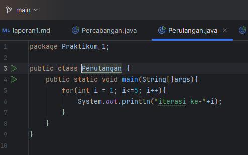

#### Latihan
4.2 Eksperimen Perulangan For

Buat file LatWhile

Buat program untuk mencetak bilangan ganjil dari 1 hingga 20..

Jalankan program

#### Screenshoot Hasil
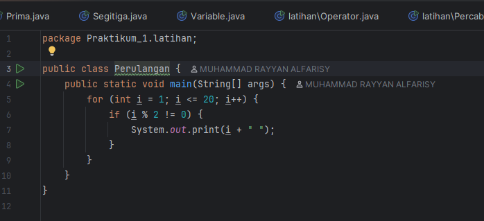

4.3 Eksperimen Perulangan While

Buat file LatWhile

Buat program untuk mencetak bilangan ganjil dari 1 hingga 20..

Jalankan program, amati perbedaan kontrol kondisi dibanding for.

#### Screenshoot Hasil
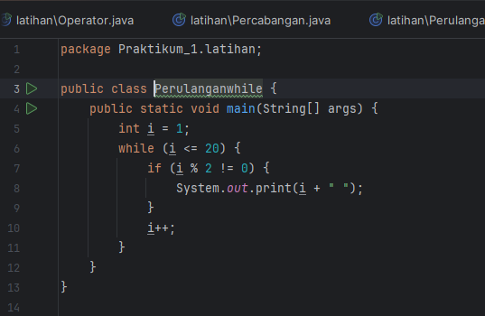

4.4 Eksperimen Perulangan Do–While

Buat file LatDoWhile

Buat program untuk mencetak bilangan ganjil dari 1 hingga 20..

Jalankan program, amati perbedaan kontrol kondisi dibanding for dan Do While.

#### Screenshoot Hasil
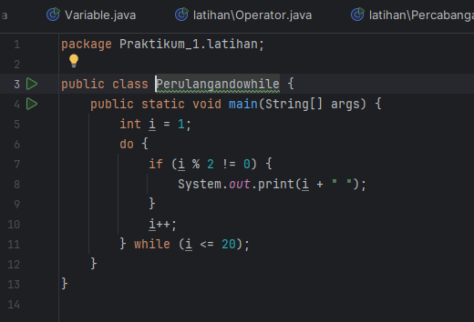

#### Analisa dan Pembahasan
Hasil percobaan perulangan for, while, dan do–while memperlihatkan bahwa masing-masing memiliki kegunaan spesifik. Perulangan for efektif saat jumlah iterasi diketahui, sedangkan while dan do–while lebih fleksibel untuk kondisi dinamis.

---
### Praktikum 5 - Practice Problem dan Solusinya
Practice Problem:

1. Buat program untuk menghitung faktorial dari suatu bilangan.
2. Buat program untuk mengecek apakah suatu bilangan adalah bilangan prima.
3. Buat program untuk mencetak pola segitiga menggunakan *.

solusinya:

5.1 program faktorial
buat class baru di praktikum_1 dengan nama factorial

isi dengan code

Amati hasil program
#### Screenshoot Hasil
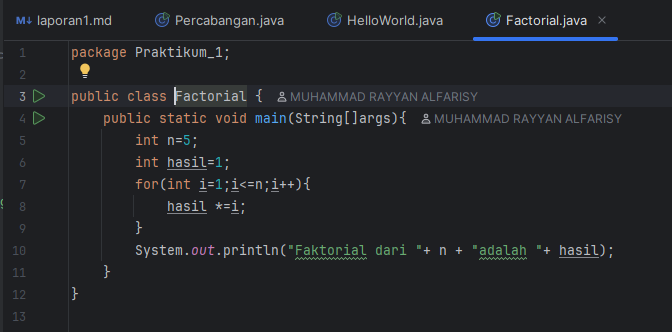

5.2 program Prima
buat class baru di praktikum_1 dengan nama Prima

isi dengan code

Amati hasil program
#### Screenshoot Hasil
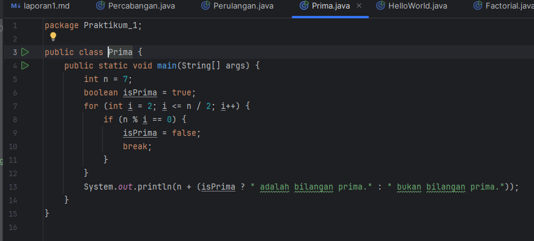

5.3 program segitiga
buat class baru di praktikum_1 dengan nama segitiga

isi dengan code

Amati hasil program
#### Screenshoot Hasil
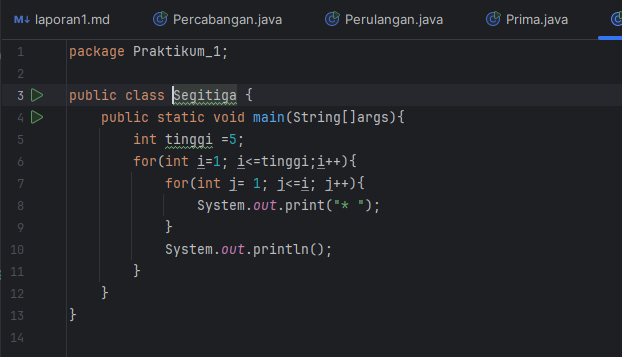

---

### kesimpulan
Berdasarkan praktikum yang telah dilakukan sesuai dengan modul yang diberikan, dapat disimpulkan bahwa pemahaman mengenai dasar-dasar pemrograman sangat penting dalam proses pembuatan program. Praktikum ini membahas berbagai konsep dasar seperti penggunaan operator, ekspresi, serta cara kerja perhitungan dan logika dalam suatu program. Melalui kegiatan praktikum, mahasiswa dapat memahami bagaimana komputer memproses data menggunakan berbagai jenis operator dan bagaimana ekspresi digunakan untuk menghasilkan suatu nilai.

Selain itu, praktikum ini juga membantu mahasiswa memahami cara menuliskan sintaks program dengan benar serta memahami urutan operasi dalam suatu perhitungan. Dengan mempraktikkan langsung contoh-contoh yang ada pada modul, mahasiswa dapat mengetahui bagaimana program dijalankan serta bagaimana hasil dari setiap operasi yang dilakukan oleh komputer.

Secara keseluruhan, praktikum ini memberikan pemahaman yang lebih baik mengenai konsep dasar pemrograman dan cara penerapannya dalam pembuatan program sederhana. Dengan memahami materi yang terdapat dalam modul, mahasiswa diharapkan mampu menerapkan konsep tersebut dalam pengembangan program yang lebih kompleks pada tahap pembelajaran selanjutnya.

## 5. Referensi
Duniailkom.
Tutorial Belajar Java: Tipe Data Array dalam Bahasa Pemrograman Java.
Diakses dari: https://www.duniailkom.com/tutorial-belajar-java-tipe-data-array-bahasa-pemrograman-java/

Mohd Rzu. 2024. Modul Operator dan Ekspresi. Tersedia pada: https://hackmd.io/@mohdrzu/BkBn4sEcyl

Kurniawan, A. 2020. Dasar-Dasar Pemrograman. Jakarta: Informatika.

---
