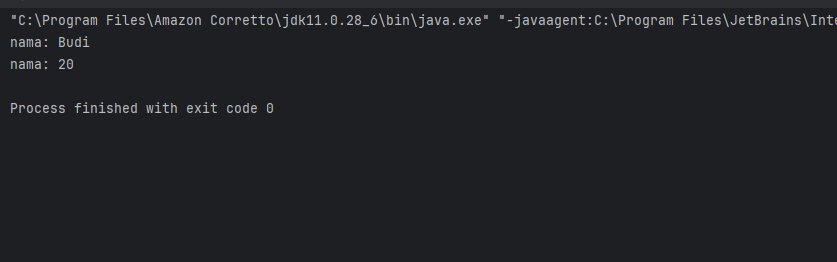

# Laporan Modul 2: Review konsep Dasar OOP Menggunakan Java
**Mata Kuliah:** Desain Pattern  
**Nama:** MUHAMMAD RAYYAN ALFARISY
**NIM:** 2024573010118
**Kelas:** TI 2A

---

## 1. Abstrak

Pemrograman Berorientasi Objek atau Object-Oriented Programming (OOP) merupakan paradigma pemrograman yang berfokus pada penggunaan objek sebagai representasi dari data dan perilaku dalam sebuah program. Konsep ini bertujuan untuk meningkatkan struktur, modularitas, serta kemudahan dalam pengembangan dan pemeliharaan perangkat lunak.

Pada praktikum ini dilakukan peninjauan kembali terhadap empat pilar utama OOP yaitu Encapsulation, Inheritance, Polymorphism, dan Abstraction menggunakan bahasa pemrograman Java. Selain itu juga dipelajari konsep dasar seperti Class dan Object serta konsep Composition yang sering digunakan dalam pengembangan perangkat lunak berorientasi objek.

Melalui serangkaian latihan dan implementasi program sederhana, mahasiswa diharapkan dapat memahami cara kerja konsep-konsep OOP serta mampu menerapkannya dalam pembuatan program berbasis Java.
---
## Review 4 Pillar OOP Menggunakan Java
### Tujuan
Tujuan dari praktikum ini adalah:

Memahami konsep dasar dalam pemrograman berorientasi objek seperti Class, Object, Encapsulation, Inheritance, Polymorphism, dan Abstraction.
Mampu membuat program sederhana menggunakan pendekatan OOP dengan bahasa pemrograman Java.
Menerapkan prinsip-prinsip OOP dalam menyelesaikan permasalahan pemrograman secara terstruktur.

## Bagian 1 - Pengenalan OOP dan Class-Object
Object-Oriented Programming (OOP) merupakan paradigma pemrograman yang menggunakan objek sebagai komponen utama dalam membangun sebuah program. Objek tersebut merepresentasikan data serta fungsi yang dapat digunakan untuk memproses data tersebut.

Dalam OOP terdapat beberapa konsep dasar, yaitu:

Class
Class merupakan blueprint atau template yang digunakan untuk membuat objek. Class mendefinisikan atribut serta metode yang dimiliki oleh objek.

Object
Object adalah instansi dari sebuah class. Object memiliki nilai atribut tertentu serta dapat menjalankan metode yang telah didefinisikan di dalam class.

### Langkah Praktikum
1. Buka project pada praktikum sebelumnya menggunakan intellij IDEA
2. Buat sebuah package baru di dalam folder `src` dengan cara klik kanan pada folder `src` kemudian pilih `New -> Package`. Beri nama `modul_3`.
3. Buat Sebuah package baru lagi didalam package `modul_3` dengan cara klik kanan dan pilih `New -> Package`. Beri nama `bagian_1`
4. Kemudian buat sebuah class baru dengan nama `Mahasiswa` dan isikan kode berikut:

        public class Mahasiswa {
        //atribut
        
            String nama;
            int umur;
        
            //metode
            void displayInfo(){
                System.out.println("nama: "+ nama);
                System.out.println("nama: "+ umur);
            }
        }

6. Selanjutnya, buat sebuah class baru dengan nama `Main` dan isikan kode berikut:

        public class Main {
        public static void main(String[] args){
        //Membuat objek
        
                Mahasiswa mhs1=new Mahasiswa();
                mhs1.nama="Budi";
                mhs1.umur=20;
        
                mhs1.displayInfo();
            }
        }

7. Jalankan dan lihat hasilnya.

### Latihan
1. Buat class Buku dengan atribut judul, penulis, dan tahunTerbit.

        public class Buku {
        // Atribut
        String judul;
        String penulis;
        int tahunTerbit;
        
            // Constructor
            public Buku(String judul, String penulis, int tahunTerbit) {
                this.judul = judul;
                this.penulis = penulis;
                this.tahunTerbit = tahunTerbit;
            }
        
            // Method untuk menampilkan info buku
            public void tampilkanInfo() {
                System.out.println("Informasi Buku:");
                System.out.println("Judul        : " + judul);
                System.out.println("Penulis      : " + penulis);
                System.out.println("Tahun Terbit : " + tahunTerbit);
                System.out.println("---------------------------");
            }
        }

2. Buat objek dari class Buku dan tampilkan informasi buku ke layar.

        public class Main {
        public static void main(String[] args) {
        // Membuat objek dari class Buku
        Buku buku1 = new Buku("Laskar Pelangi", "Andrea Hirata", 2005);
        Buku buku2 = new Buku("Bumi", "Tere Liye", 2014);
        
                // Menampilkan informasi objek
                buku1.tampilkanInfo();
                buku2.tampilkanInfo();
            }
         }

#### Screenshoot

---
## Bagian 2 - Encapsulation (Enkapsulasi)
Encapsulation merupakan konsep dalam OOP yang digunakan untuk menyembunyikan detail internal suatu objek agar tidak dapat diakses secara langsung dari luar class. Tujuan dari enkapsulasi adalah untuk menjaga keamanan data serta mengontrol akses terhadap atribut dalam class.

Dalam Java, enkapsulasi biasanya diterapkan dengan cara:

Menggunakan access modifier seperti private, protected, dan public.
Menggunakan getter dan setter untuk mengakses dan mengubah nilai atribut.
### Langkah Praktikum
1. Buat Sebuah package baru lagi didalam package `modul_3` dengan cara klik kanan dan pilih `New -> Package`. Beri nama `bagian_2`
2. Kemudian buat sebuah class baru dengan nama `Mahasiswa` dan isikan kode berikut:

        public class Mahasiswa {
        private  String  nama;
        private int umur;
        
            public String getNama(){
                return nama;
        
            }
        
            public void setNama(String nama){
                this.nama=nama;
            }
        
            public int getUmur(){
                return umur;
            }
        
            public void setUmur(int umur){
                this.umur=umur;
            }
        }

3. Kemudian buat sebuah class baru dengan nama `Main` dan isikan kode berikut:

        public class Main {
        public static void main(String[] args){
        Mahasiswa mhs1 = new Mahasiswa();
        mhs1.setNama("Budi");
        mhs1.setUmur(20);
        
                System.out.println("nama:"+mhs1.getNama());
                System.out.println("Umur:"+mhs1.getUmur());
            }
        }

4. Jalankan program untuk melihat hasilnya.

### Latihan
1. Buat class Motor dengan atribut merk dan tahun yang dienkapsulasi/bersifat private.
2. Buat getter dan setter untuk mengakses atribut .

        public class Motor {
        // Atribut diatur menjadi private (Enkapsulasi)
        private String merk;
        private int tahun;
        
            // Constructor
            public Motor(String merk, int tahun) {
                this.merk = merk;
                this.tahun = tahun;
            }
        
            // Getter untuk merk (Mengambil nilai)
            public String getMerk() {
                return merk;
            }
        
            // Setter untuk merk (Mengubah nilai)
            public void setMerk(String merk) {
                this.merk = merk;
            }
        
            // Getter untuk tahun
            public int getTahun() {
                return tahun;
            }
        
            // Setter untuk tahun
            public void setTahun(int tahun) {
                // Keuntungan setter: kita bisa menambah validasi
                if (tahun > 1885) { // Tahun motor pertama diciptakan
                    this.tahun = tahun;
                } else {
                    System.out.println("Tahun tidak valid!");
                }
            }
        }

3. buat class nama `Main` 

        public class Main {
        public static void main(String[] args) {
        // Membuat objek
        Motor motorSaya = new Motor("Honda", 2020);
        
                // Mengakses data menggunakan Getter
                System.out.println("Merk Awal: " + motorSaya.getMerk());
        
                // Mengubah data menggunakan Setter
                motorSaya.setMerk("Yamaha");
                motorSaya.setTahun(2023);
        
                System.out.println("Merk Baru: " + motorSaya.getMerk());
                System.out.println("Tahun Baru: " + motorSaya.getTahun());
            }
        }

#### screenshoot

---

## Bagian 3 - Inheritance (Pewarisan) dan Composition (Komposisi)
Dalam pemrograman berorientasi objek, hubungan antar class dapat dibangun menggunakan konsep Inheritance maupun Composition. Kedua konsep ini digunakan untuk meningkatkan penggunaan kembali kode serta membuat program lebih modular.
#### Inheritance (Pewarisan)
Inheritance merupakan mekanisme di mana sebuah class dapat mewarisi atribut dan metode dari class lain. Class yang mewarisi disebut subclass, sedangkan class yang diwarisi disebut superclass.

Inheritance menggambarkan hubungan "is-a", contohnya Mobil adalah Kendaraan.
##### Ciri-Ciri Inheritance:
- Menggunakan keyword extends.
- Subclass mewarisi atribut dan metode dari superclass.
- Subclass dapat menambahkan metode baru atau mengganti metode yang sudah ada.

### Langkah Praktikum
1. Buat Sebuah package baru lagi didalam package `modul_3` dengan cara klik kanan dan pilih `New -> Package`. Beri nama `bagian_3`
2. Buat package baru di dalam `bagian_3` dan beri nama `pewarisan`
3. Kemudian buat sebuah class baru dengan nama `Kendaraan` dan isikan kode berikut:

        public class Kendaraan {
        String merk;
        int tahun;
        
            void displayInfo(){
                System.out.println("merk :" + merk);
                System.out.println("tahun :" + tahun);
            }
        }

4. Kemudian buat sebuah class baru dengan nama `Mobil` dan isikan kode berikut:

        class Mobil extends Kendaraan {
        int jumlahPintu;
        
            void displayInfoMobil(){
                displayInfo();
                System.out.println("Jumlah Pintu :" + jumlahPintu);
            }
        }

5. Kemudian buat sebuah class baru dengan nama `Main` dan isikan kode berikut:

        public class Main {
        public static void main(String[] args){
        Mobil mobil1=new Mobil();
        mobil1.merk="Toyota";
        mobil1.tahun=2021;
        mobil1.jumlahPintu=4;
        
                mobil1.displayInfoMobil();
            }
        }

6. Jalankan program dan lihat hasilnya.

#### Composition (Komposisi)
Composition merupakan konsep di mana sebuah class memiliki objek dari class lain sebagai bagian dari strukturnya. Hubungan ini dikenal sebagai hubungan "has-a".

Sebagai contoh, sebuah Mobil memiliki Mesin.
##### Karakteristik Composition:
- Menggunakan objek dari class lain sebagai atribut.
- Tidak menggunakan keyword khusus.
- Lebih fleksibel dibandingkan inheritance karena tidak bergantung pada hierarki class.

### Langkah Praktikum
1. Buat package baru di dalam `bagian_3` dan beri nama `komposisi`
2. Kemudian buat sebuah class baru dengan nama `Mesin` dan isikan kode berikut:

        public class Mesin {
        void hidupkan(){
        System.out.println("Mesin menyala.");
        }
        void matikan(){
        System.out.println("Mesin dimatikan");
        }
        }

#### screenshoot
3. Kemudian buat sebuah class baru dengan nama `Mobil` dan isikan kode berikut:

        class Mobil {
        private final Mesin mesin; //komposisi
        
            public Mobil(){
                this.mesin = new Mesin(); //membuat objek Mesin
            }
        
            void mulai(){
                mesin.hidupkan();
                System.out.println("mobil siap digunakan.");
            }
        
            void berhenti(){
                mesin.matikan();
                System.out.println("Mobil berhenti");
            }
        }

4. Kemudian buat sebuah class baru dengan nama `Main` dan isikan kode berikut:

        public class Main {
        public static void main(String[] args){
        Mobil mobil = new Mobil();
        mobil.mulai();
        mobil.berhenti();
        }
        }

5. Jalankan program dan lihat hasilnya.

#### Perbandingan Inheritance dan Composition
## Perbandingan Inheritance dan Composition
Inheritance dan Composition merupakan dua konsep penting dalam pemrograman berorientasi objek yang digunakan untuk membangun hubungan antar class. Inheritance adalah mekanisme di mana sebuah class dapat mewarisi atribut dan metode dari class lain. Konsep ini menggambarkan hubungan “is-a” atau hubungan hierarki, di mana suatu objek merupakan jenis dari objek lain. Contohnya adalah hubungan antara class Mobil dan Kendaraan, di mana Mobil merupakan bagian dari jenis Kendaraan. Dalam Java, inheritance diimplementasikan menggunakan keyword extends, sehingga class turunan dapat menggunakan kembali atribut dan metode dari class induk.

Sementara itu, Composition adalah konsep di mana sebuah class memiliki objek dari class lain sebagai bagian dari strukturnya. Konsep ini menggambarkan hubungan “has-a” atau hubungan kepemilikan. Sebagai contoh, sebuah Mobil memiliki komponen seperti Mesin, Roda, dan Bahan Bakar. Dalam composition tidak ada keyword khusus yang digunakan, melainkan hanya dengan membuat objek dari class lain sebagai atribut dalam class tersebut. Pendekatan ini dianggap lebih fleksibel karena tidak terikat pada struktur hierarki class dan memungkinkan penggunaan kembali komponen secara lebih bebas.

Secara umum, inheritance memiliki tingkat ketergantungan yang lebih kuat antara superclass dan subclass, sehingga perubahan pada class induk dapat mempengaruhi class turunannya. Sebaliknya, composition memiliki tingkat ketergantungan yang lebih rendah karena class hanya menggunakan objek dari class lain tanpa harus berada dalam hubungan hierarki. Oleh karena itu, composition sering dianggap lebih fleksibel dan lebih mudah untuk dikembangkan dalam sistem yang kompleks.

#### Kapan Menggunakan Inheritance vs Composition?
Penggunaan inheritance sebaiknya dilakukan ketika terdapat hubungan yang jelas antara dua class dalam bentuk “is-a”. Artinya, class turunan benar-benar merupakan jenis dari class induk. Inheritance juga cocok digunakan ketika ingin mewarisi seluruh atribut dan metode dari class induk sehingga kode dapat digunakan kembali secara langsung. Selain itu, inheritance juga berguna ketika ingin melakukan method overriding untuk mengubah perilaku method yang diwarisi dari superclass.

Di sisi lain, composition sebaiknya digunakan ketika hubungan antara class bersifat “has-a” atau kepemilikan. Composition cocok digunakan ketika sebuah class dibangun dari beberapa komponen yang berasal dari class lain. Pendekatan ini juga lebih disarankan ketika ingin mengurangi ketergantungan antar class sehingga program menjadi lebih fleksibel dan mudah dikembangkan. Dalam banyak kasus pengembangan perangkat lunak modern, composition lebih sering digunakan karena memungkinkan penggabungan berbagai objek untuk membentuk sistem yang lebih kompleks tanpa harus bergantung pada struktur pewarisan.

### Langkah Praktikum
1. Di dalam package `bagian_3`, buat sebuah class baru dan beri nama `Main` dan isikan kode berikut:

        // Class untuk Composition
        class Mesin {
        void hidupkan() {
        System.out.println("Mesin menyala.");
        }
        
            void matikan() {
                System.out.println("Mesin dimatikan.");
            }
        }
        
        // Superclass untuk Inheritance
        class Kendaraan {
        void bergerak() {
        System.out.println("Kendaraan sedang bergerak.");
        }
        }
        
        // Subclass yang menggunakan Composition dan Inheritance
        class Mobil extends Kendaraan {
        private Mesin mesin; // Composition
        
            public Mobil() {
                this.mesin = new Mesin(); // Membuat objek Mesin
            }
        
            void mulai() {
                mesin.hidupkan();
                System.out.println("Mobil siap digunakan.");
            }
        
            void berhenti() {
                mesin.matikan();
                System.out.println("Mobil berhenti.");
            }
        }
        
        public class Main {
        public static void main(String[] args) {
        Mobil mobil = new Mobil();
        mobil.mulai();     // Method dari Composition
        mobil.bergerak();  // Method dari Inheritance
        mobil.berhenti();  // Method dari Composition
        }
        }

2. Jalankan dan lihat hasilnya.

### Latihan
1. Buat class `Laptop` yang memiliki komponen Processor dan RAM (gunakan composition).

        public class Laptop {
        private String merk;
        // Laptop "memiliki" Processor dan RAM
        private Processor processor;
        private RAM ram;
        
            public Laptop(String merk, String modelProc, int kapasitasRam) {
                this.merk = merk;
                // Objek komponen dibuat di dalam constructor Laptop
                this.processor = new Processor(modelProc);
                this.ram = new RAM(kapasitasRam);
            }
        
            public void nyalakan() {
                System.out.println("Menyalakan Laptop " + merk + "...");
                ram.baca();
                processor.jalankan();
                System.out.println("Laptop siap digunakan.");
            }
        }

2. Buat class `Processor` dengan metode `jalankan()`.

        public class Processor {
        private String model;
        
            public Processor(String model) {
                this.model = model;
            }
        
            public void jalankan() {
                System.out.println("Processor " + model + " sedang memproses instruksi...");
            }
        }

3. Buat class `RAM` dengan metode `baca()` dan `tulis()`.

        public class RAM {
        private int kapasitas; // dalam GB
        
            public RAM(int kapasitas) {
                this.kapasitas = kapasitas;
            }
        
            public void baca() {
                System.out.println("Membaca data dari RAM " + kapasitas + "GB...");
            }
        
            public void tulis() {
                System.out.println("Menulis data ke RAM...");
            }
        }

4. Implementasikan class `Laptop` yang menggunakan objek `Processor` dan `RAM`.

        public class Main {
        public static void main(String[] args) {
        // Membuat objek Laptop yang secara otomatis membuat Processor dan RAM di dalamnya
        Laptop laptopSaya = new Laptop("Asus ROG", "Intel i9", 32);
        
                laptopSaya.nyalakan();
            }
        }

#### screenshoot

---
## Bagian 4 - Polymorphism (Polimorfisme)
Polymorphism merupakan kemampuan sebuah objek untuk memiliki berbagai bentuk perilaku. Dalam Java, polymorphism dapat diterapkan melalui method overriding dan method overloading.
#### Method Overriding
Method overriding terjadi ketika subclass memberikan implementasi baru terhadap method yang telah didefinisikan di superclass.
##### Ciri-ciri overriding antara lain:

- Nama method harus sama dengan method di superclass.
- Parameter method harus sama.
- Return type harus sama atau turunan dari return type superclass..

### Langkah Praktikum
1. Buat Sebuah package baru lagi didalam package `modul_3` dengan cara klik kanan dan pilih `New -> Package`. Beri nama `bagian_4`
2. Kemudian buat sebuah package baru di dalam `bagian_4` dan beri nama `overriding`
3. Kemudian buat sebuah class baru dengan nama `Hewan` dan isikan kode berikut:

        public class Hewan {
        void bersuara(){
        System.out.println("hewan bersuara.");
        }
        }

4. Kemudian buat sebuah class baru dengan nama `Kucing` dan isikan kode berikut:

        class Kucing extends Hewan {
        @Override
        void bersuara(){
        System.out.println("meong!");
        }
        }

5. Kemudian buat sebuah class baru dengan nama `Anjing` dan isikan kode berikut:

        class Anjing extends Hewan {
        @Override
        void bersuara(){
        System.out.println("Guk Guk!");
        }
        }

6. Kemudian buat sebuah class baru dengan nama `Main` dan isikan kode berikut:

        public class Main {
        public static void main(String[] args){
        Hewan hewan1 = new Kucing();
        Hewan hewan2 = new Anjing();
        
                hewan1.bersuara();
                hewan2.bersuara();
            }
        }

7. Jalankan program untuk melihat hasilnya.

#### Method Overloading
Method overloading terjadi ketika sebuah class memiliki beberapa method dengan nama yang sama namun parameter yang berbeda.
##### Aturan Method Overloading:
- Method harus memiliki nama yang sama.
- Parameter harus berbeda (jumlah atau tipe).
- Return type bisa sama atau berbeda (tidak mempengaruhi overloading).
- Access modifier bisa sama atau berbeda.

### Langkah Praktikum
1. Buat sebuah package baru di dalam `bagian_4` dan beri nama `overloading`
2. Kemudian buat sebuah class baru dengan nama `Kalkulator` dan isikan kode berikut:

        public class Kalkulator {
        //method overloading : penjumlahan dua bilangan bulat
        int tambah(int a,int b){
        return a + b;
        }
        //method overloading :penjumlahan tiga bilangan buat
        int tambah(int a,int b,int c){
        return a + b + c;
        }
        //method overloading:penjumlahan bilangan desimal
        double tambah(double a,double b){
        return a + b;
        }
        }

3. Kemudian buat sebuah class baru dengan nama `Main` dan isikan kode berikut:

        public class Main {
        public static  void main (String[] args){
        Kalkulator kalkulator = new Kalkulator();
        
                System.out.println("hasil 1 :" + kalkulator.tambah(5, 10));
                System.out.println("hasil 2 :" + kalkulator.tambah(5, 10, 15));
                System.out.println("hasil 3 :" + kalkulator.tambah(3.5, 2.5));
            }
        }

4. Jalankan program untuk melihat hasilnya.

##### Perbandingan Overriding dan Overloading
| Aspek       | Overriding                                      | Overloading                                      |
|------------|--------------------------------|--------------------------------|
| Definisi   | Mengganti implementasi method di subclass | Membuat method dengan nama sama tetapi parameter berbeda |
| Parameter  | Harus sama | Harus berbeda |
| Return Type | Harus sama atau subtype | Bisa berbeda |
| Class      | Terjadi antara superclass dan subclass | Terjadi dalam satu class |
| Tujuan     | Mengubah perilaku method yang diwarisi | Memberikan fleksibilitas dalam pemanggilan method |
| Keyword    | `@Override` (opsional) | Tidak ada keyword khusus |

### Latihan
##### Latihan 1: Overriding
1. Buat class BangunDatar dengan method hitungLuas().

        public class BangunDatar {
        // Method umum yang akan di-override
        public double hitungLuas() {
        System.out.println("Menghitung luas bangun datar...");
        return 0;
        }
        }

2. Buat subclass Persegi yang meng-override method hitungLuas().

        public class Persegi extends BangunDatar {
        private double sisi;
        
            public Persegi(double sisi){
                this.sisi=sisi;
            }
            @Override
            public double hitungLuas(){
                return sisi * sisi;
            }
        }
 

3. Lingkaran yang meng-override method hitungLuas().

        public class Lingkaran extends BangunDatar{
        private double jariJari;
        
                    public Lingkaran(double jariJari){
                        this.jariJari=jariJari;
                    }
                    @Override
                    public double hitungLuas(){
                        return Math.PI*jariJari*jariJari;
                    }
                }

4. Implementasikan method hitungLuas() di masing-masing subclass.

        public class Main {
        public static void main(String[] args) {
        // Membuat objek dari subclass
        BangunDatar persegi = new Persegi(2);
        BangunDatar lingkaran = new Lingkaran(2);
        
                // Memanggil method yang telah di-override
                System.out.println("Luas Persegi: " + persegi.hitungLuas());
                System.out.format("Luas Lingkaran: %.2f\n", lingkaran.hitungLuas());
            }
        }

#### screenshoot

##### Latihan 2: Overloading
1. Buat class Matematika dengan method tambah() yang dapat menerima 2 atau 3 parameter bertipe int.
2. Tambahkan method tambah() yang menerima 2 parameter bertipe double.

        public class Matematika {
        //overloading 1
        public int tambah(int a,int b){
        return a + b;
        }
        //overloading 2
        public int tambah(int a,int b,int c){
        return a + b + c;
        }
        //overloading 3
        public double tambah(double a,double b){
        return a + b;
        }
        }

3. buat class main

        public class Main {
        public static void main(String[] args) {
        Matematika math = new Matematika();
        
                // Memanggil method dengan 2 int
                System.out.println("Hasil 5 + 10 = " + math.tambah(5, 10));
        
                // Memanggil method dengan 3 int
                System.out.println("Hasil 5 + 10 + 15 = " + math.tambah(5, 10, 15));
        
                // Memanggil method dengan 2 double
                System.out.println("Hasil 5.5 + 4.5 = " + math.tambah(5.5, 4.5));
            }
        }

#### screenshoot

---

## Bagian 5 - Abstraction (Abstraksi) | Abstract Class dan Interface
Abstraction merupakan konsep dalam OOP yang digunakan untuk menyembunyikan detail implementasi dan hanya menampilkan fungsi yang penting bagi pengguna.

Dalam Java, abstraction dapat diterapkan menggunakan:

- Abstract Class
- Interface
#### Abstract Class
Abstract class adalah class yang tidak dapat dibuat objeknya secara langsung. Class ini biasanya digunakan sebagai dasar bagi class lain yang memiliki karakteristik serupa.
##### Ciri-Ciri Abstract Class:
- Dideklarasikan dengan keyword abstract.
- Dapat memiliki atribut, method konkret, dan method abstrak.
- Method abstrak tidak memiliki body (hanya deklarasi).
- Subclass yang mewarisi abstract class harus mengimplementasikan semua method abstrak (kecuali subclass tersebut juga abstract).

### Langkah Praktikum
1. Buat Sebuah package baru lagi didalam package `modul_3` dengan cara klik kanan dan pilih `New -> Package`. Beri nama `bagian_5`
2. Buat sebuah package baru di dalam `bagian_5` dan beri nama `abstrak`.
3. Kemudian buat sebuah class baru di dalam `abtrak` dengan nama `Hewan` dan isikan kode berikut:

        abstract class Hewan {
        String nama;
        
            void makan(){
                System.out.println(nama + "sedang makan.");
            }
        
            abstract void bersuara();
        }

4. Kemudian buat sebuah class baru di dalam `abtrak` dengan nama `Kucing` dan isikan kode berikut:

        class Kucing extends Hewan {
        @Override
        void bersuara(){
        System.out.println("Meong!");
        }
        }

5. Kemudian buat sebuah class baru di dalam `abtrak` dengan nama `Anjing` dan isikan kode berikut:

        class Anjing extends Hewan {
        @Override
        void bersuara(){
        System.out.println("Guk Guk!");
        }
        }

6. Kemudian buat sebuah class baru dengan nama `Main` dan isikan kode berikut:

        public class Main {
        public static void main(String[] args){
        Hewan Kucing = new Kucing();
        Kucing.makan();
        Kucing.bersuara();
        
                Hewan anjing =  new Anjing();
                anjing.makan();
                anjing.bersuara();
            }
        }

7. Jalankan program untuk melihat hasilnya.

#### Interface
Interface merupakan blueprint yang berisi kumpulan method yang harus diimplementasikan oleh class yang menggunakannya.
##### Ciri-Ciri Interface:
- Semua method bersifat abstract secara default.
- Sebuah class dapat mengimplementasikan lebih dari satu interface.
- Digunakan untuk mendefinisikan kemampuan tertentu.
### Langkah Praktikum
1. Buat sebuah package baru di dalam `bagian_5` dan beri nama `antarmuka`.
2. Kemudian buat sebuah interface baru di dalam `antarmuka` dengan nama `Bergerak` dan isikan kode berikut:

        public interface Bergerak {
        void bergerak();
        
            default void berhenti(){
                System.out.println("berhenti bergerak.");
            }
        
            static void info(){
                System.out.println("ini adalah interface bergerak.");
            }
        }

3. Kemudian buat sebuah class baru di dalam `antarmuka` dengan nama `Mobil` dan isikan kode berikut:

        public class Mobil implements Bergerak {
        @Override
        public void bergerak(){
        System.out.println("mobil sedang melaju");
        }
        }

4. Kemudian buat sebuah class baru di dalam `antarmuka` dengan nama `Pesawat` dan isikan kode berikut:

        public class Pesawat implements Bergerak {
        @Override
        public void bergerak() {
        System.out.println("pesawat sedang terbang");
        }
        }

5. Kemudian buat sebuah class baru dengan nama `Main` dan isikan kode berikut:

        public class Main {
        public static void main(String[] args){
        Bergerak mobil = new Mobil();
        mobil.bergerak();
        mobil.berhenti();
        
                Bergerak pesawat = new Pesawat();
                pesawat.bergerak();
                pesawat.berhenti();
        
                Bergerak.info();
            }
        }

6. Jalankan program untuk melihat hasilnya.

#### Perbandingan Abstract Class dan Interface
| Aspek       | Abstract Class                                  | Interface                                      |
|------------|---------------------------------|--------------------------------|
| Keyword    | `abstract class` | `interface` |
| Method     | Bisa memiliki method abstrak dan konkret | Sebelum Java 8: hanya method abstrak. Java 8+: bisa memiliki method default dan static. |
| Atribut    | Bisa memiliki atribut non-static | Hanya bisa memiliki konstanta (`public static final`) |
| Constructor | Bisa memiliki constructor | Tidak bisa memiliki constructor |
| Inheritance | Subclass hanya bisa mewarisi satu abstract class | Class bisa mengimplementasikan banyak interface |
| Penggunaan | Cocok untuk class-class yang memiliki hubungan "is-a" (misalnya, Kucing adalah Hewan) | Cocok untuk mendefinisikan kontrak atau kemampuan (misalnya, Bergerak, Terbang) |

#### Kapan Menggunakan Abstract Class dan Interface
###### Gunakan Abstract Class Jika:
- Anda ingin membuat blueprint untuk class-class yang memiliki perilaku dan atribut yang sama.
- Anda ingin memiliki method konkret yang dapat diwarisi oleh subclass.
- Anda ingin mengontrol state objek melalui atribut non-static.

###### Gunakan Interface Jika:
- Anda ingin mendefinisikan kontrak atau kemampuan yang harus diimplementasikan oleh class-class yang berbeda.
- Anda ingin mendukung multiple inheritance (sebuah class bisa mengimplementasikan banyak interface).
- Anda ingin menambahkan fungsionalitas tambahan ke class tanpa mengubah struktur class tersebut (menggunakan method default di Java 8+).

Dalam Sebuah program, kita juga dapat mengkombinasikan abstract class dengan interface.

### Langkah Praktikum
1. Didalam package `bagian_5`, buatlah sebuah class baru dan beri nama `Main` dan isikan kode berikut:

        interface Terbang {
        void terbang();
        }
        
        // Abstract Class
        abstract class Hewan {
        String nama;
        
            abstract void bersuara();
        }
        
        // Class yang mewarisi abstract class dan mengimplementasikan interface
        class Burung extends Hewan implements Terbang {
        @Override
        void bersuara() {
        System.out.println("Kicau kicau!");
        }
        
            @Override
            public void terbang() {
                System.out.println(nama + " sedang terbang.");
            }
        }
        
        public class Main {
        public static void main(String[] args) {
        Burung burung = new Burung();
        burung.nama = "Merpati";
        burung.bersuara();
        burung.terbang();
        }
        }

2. Jalankan program untuk melihat hasilnya.

### Latihan
1. Buat sebuah interface `Berenang` dengan method `berenang()`.

        public interface Berenang {
        void berenang();
        }

2. Buat abstract class `HewanAir` dengan atribut `nama` dan method abstrak `makan()`.

        public abstract class HewanAir {
        protected String nama;
        
            public HewanAir(String nama) {
                this.nama = nama;
            }
        
            // Method abstrak yang wajib diimplementasikan oleh subclass
            public abstract void makan();
        }

3. Buat class `Ikan` yang mewarisi `HewanAir` dan mengimplementasikan `Berenang`.

        public class Ikan extends HewanAir implements Berenang {
        
            public Ikan(String nama) {
                super(nama);
            }
        
            // Mengimplementasikan method dari abstract class HewanAir
            @Override
            public void makan() {
                System.out.println(nama + " sedang makan pelet atau plankton.");
            }
        
            // Mengimplementasikan method dari interface Berenang
            @Override
            public void berenang() {
                System.out.println(nama + " berenang dengan cara menggerakkan siripnya.");
            }
        }

4. Implementasikan method `berenang()` dan `makan()` di class `Ikan`.

        public class Main {
        public static void main(String[] args) {
        Ikan ikanNemo = new Ikan("Nemo");
        
                ikanNemo.makan();
                ikanNemo.berenang();
            }
        }

#### screenshoot

---

## Bagian 6 - Aplikasi Console Pemesanan Tiket Sederhana
Pada bagian ini dibuat sebuah aplikasi sederhana berbasis console untuk melakukan pemesanan tiket konferensi. Aplikasi ini mengimplementasikan seluruh konsep utama OOP yang telah dipelajari sebelumnya.

Fitur yang tersedia dalam aplikasi ini meliputi:

1. Menampilkan daftar tiket yang tersedia.
2. Memesan tiket sesuai jenis dan jumlah yang diinginkan.
3. Menampilkan detail pesanan berdasarkan nomor pesanan.
4. Membatalkan pesanan yang telah dibuat.
5. Menghitung total harga tiket yang dipesan.
6. Memberikan diskon berdasarkan jenis tiket.

Dalam aplikasi ini beberapa konsep OOP diterapkan, antara lain:

Encapsulation pada atribut class Tiket.
Inheritance pada class TiketReguler dan TiketVIP yang mewarisi class Tiket.
Polymorphism pada method hitungDiskon() yang dioverride oleh subclass.
Abstraction dengan menjadikan class Tiket sebagai abstract class.

### Langkah Praktikum
1. Buat Sebuah package baru lagi didalam package `modul_3` dengan cara klik kanan dan pilih `New -> Package`. Beri nama `bagian_6`
2. Kemudian buat sebuah class baru dengan nama `Tiket` dan isikan kode berikut:

        abstract class Tiket {
        private final String jenis;
        private final double harga;
        
            public Tiket(String jenis, double harga){
                this.jenis=jenis;
                this.harga=harga;
            }
        
            public String getJenis(){
                return jenis;
            }
            public double getHarga(){
                return harga;
            }
        
            //abstrak method untuk menghitung diskon
            public abstract double hitungDiskon();
        }

3. Kemudian buat sebuah class baru dengan nama `TiketReguler` dan isikan kode berikut:

        class TiketReguler extends Tiket{
        public TiketReguler(){
        super("Reguler",1000000);
        }
        @Override
        public double hitungDiskon(){
        return 0;
        }
        }

4. Kemudian buat sebuah class baru dengan nama `TiketVIP` dan isikan kode berikut:

        class TiketVIP extends Tiket{
        public TiketVIP(){
        super("VIP",2500000);
        }
        @Override
        public double hitungDiskon(){
        return 0.1 * getHarga();
        }
        }

5. Kemudian buat sebuah class baru dengan nama `Pesanan` dan isikan kode berikut:

        class Pesanan {
        private final String namaPemesan;
        private final Tiket tiket;
        private final int jumlah;
        
            public Pesanan(String namaPemesan, Tiket tiket, int jumlah) {
                this.namaPemesan = namaPemesan;
                this.tiket = tiket;
                this.jumlah = jumlah;
            }
        
            public String getNamaPemesan() {
                return namaPemesan;
            }
        
            public Tiket getTiket() {
                return tiket;
            }
        
            public int getJumlah() {
                return jumlah;
            }
        
            // Menghitung total harga setelah diskon
            public double hitungTotal() {
                double total = tiket.getHarga() * jumlah;
                double diskon = tiket.hitungDiskon() * jumlah;
                return total - diskon;
            }
        
            // Menampilkan detail pesanan
            public void displayDetail() {
                System.out.println("\nDetail Pesanan:");
                System.out.println("Nama Pemesan: " + namaPemesan);
                System.out.println("Jenis Tiket: " + tiket.getJenis());
                System.out.println("Jumlah: " + jumlah);
                System.out.println("Total Harga: Rp" + hitungTotal());
            }
        }

6. Kemudian buat sebuah class baru dengan nama `KonferensiApp` dan isikan kode berikut:

        import java.util.ArrayList;
        import java.util.Scanner;
        
        public class KonferensiApp {
        private static final ArrayList<Pesanan> daftarPesanan = new ArrayList<>();
        private static final Scanner scanner = new Scanner(System.in);
        
            public static void main(String[] args) {
                while (true) {
                    System.out.println("\n=== Aplikasi Pemesanan Tiket Konferensi ===");
                    System.out.println("1. Lihat Daftar Tiket");
                    System.out.println("2. Pesan Tiket");
                    System.out.println("3. Lihat Detail Pesanan");
                    System.out.println("4. Batalkan Pesanan");
                    System.out.println("5. Keluar");
                    System.out.print("Pilih menu: ");
                    int pilihan = scanner.nextInt();
                    scanner.nextLine(); // Membersihkan newline
        
                    switch (pilihan) {
                        case 1:
                            lihatDaftarTiket();
                            break;
                        case 2:
                            pesanTiket();
                            break;
                        case 3:
                            lihatDetailPesanan();
                            break;
                        case 4:
                            batalkanPesanan();
                            break;
                        case 5:
                            System.out.println("Terima kasih telah menggunakan aplikasi ini.");
                            System.exit(0);
                        default:
                            System.out.println("Pilihan tidak valid. Silakan coba lagi.");
                    }
                }
            }
        
            // Method untuk menampilkan daftar tiket
            private static void lihatDaftarTiket() {
                System.out.println("\nDaftar Tiket:");
                System.out.println("1. Tiket Reguler - Rp100.000");
                System.out.println("2. Tiket VIP - Rp250.000 (Diskon 10%)");
            }
        
            // Method untuk memesan tiket
            private static void pesanTiket() {
                System.out.print("\nMasukkan nama pemesan: ");
                String namaPemesan = scanner.nextLine();
        
                System.out.print("Pilih jenis tiket (1: Reguler, 2: VIP): ");
                int jenisTiket = scanner.nextInt();
                System.out.print("Masukkan jumlah tiket: ");
                int jumlah = scanner.nextInt();
        
                Tiket tiket = null;
                switch (jenisTiket) {
                    case 1:
                        tiket = new TiketReguler();
                        break;
                    case 2:
                        tiket = new TiketVIP();
                        break;
                    default:
                        System.out.println("Jenis tiket tidak valid.");
                        return;
                }
        
                Pesanan pesanan = new Pesanan(namaPemesan, tiket, jumlah);
                daftarPesanan.add(pesanan);
                System.out.println("Pesanan berhasil dibuat!");
                pesanan.displayDetail();
            }
        
            // Method untuk melihat detail pesanan
            private static void lihatDetailPesanan() {
                if (isNoPesanan()) return;
        
                System.out.print("Pilih nomor pesanan untuk melihat detail: ");
                int nomorPesanan = scanner.nextInt();
                if (nomorPesanan > 0 && nomorPesanan <= daftarPesanan.size()) {
                    daftarPesanan.get(nomorPesanan - 1).displayDetail();
                } else {
                    System.out.println("Nomor pesanan tidak valid.");
                }
            }
        
            private static boolean isNoPesanan() {
                if (daftarPesanan.isEmpty()) {
                    System.out.println("\nBelum ada pesanan.");
                    return true;
                }
        
                System.out.println("\nDaftar Pesanan:");
                for (int i = 0; i < daftarPesanan.size(); i++) {
                    System.out.println((i + 1) + ". " + daftarPesanan.get(i).getNamaPemesan());
                }
                return false;
            }
        
            // Method untuk membatalkan pesanan
            private static void batalkanPesanan() {
                if (isNoPesanan()) return;
        
                System.out.print("Pilih nomor pesanan yang ingin dibatalkan: ");
                int nomorPesanan = scanner.nextInt();
                if (nomorPesanan > 0 && nomorPesanan <= daftarPesanan.size()) {
                    daftarPesanan.remove(nomorPesanan - 1);
                    System.out.println("Pesanan berhasil dibatalkan.");
                } else {
                    System.out.println("Nomor pesanan tidak valid.");
                }
            }
        }

#### Fitur Apliaksi:
1. Lihat Daftar Tiket: Menampilkan jenis tiket dan harganya.
2. Pesan Tiket: Memungkinkan pengguna memesan tiket dengan memilih jenis dan jumlah.
3. Lihat Detail Pesanan: Menampilkan detail pesanan berdasarkan nomor pesanan.
4. Batalkan Pesanan: Menghapus pesanan berdasarkan nomor pesanan.
5. Hitung Total Harga: Menghitung total harga setelah diskon (jika ada).

#### Penjelasan Program:
1. Encapsulation: Atribut seperti `jenis` dan `harga` dienkapsulasi dalam class Tiket.
2. Inheritance: `TiketReguler` dan `TiketVIP` mewarisi class Tiket.
3. Polymorphism: Method `hitungDiskon()` di-override di subclass.
4. Abstraction: Class `Tiket` adalah abstract class dengan method abstrak `hitungDiskon()`.

### Output Program:

---

## Penutup
Berdasarkan praktikum yang telah dilakukan, dapat disimpulkan bahwa pemrograman berorientasi objek merupakan metode pemrograman yang sangat penting dalam pengembangan perangkat lunak modern. Dengan menggunakan konsep OOP, program dapat disusun secara lebih terstruktur, modular, serta mudah untuk dikembangkan.

Dalam praktikum ini telah dipelajari berbagai konsep utama OOP yaitu Class dan Object, Encapsulation, Inheritance, Polymorphism, Abstraction, serta Composition. Setiap konsep memiliki peran penting dalam membangun sistem perangkat lunak yang fleksibel dan mudah dipelihara.

Melalui latihan dan implementasi program menggunakan bahasa pemrograman Java, mahasiswa dapat memahami bagaimana konsep-konsep tersebut diterapkan secara nyata dalam pembuatan aplikasi. Dengan penguasaan konsep OOP yang baik, diharapkan mahasiswa mampu mengembangkan program yang lebih kompleks dan efisien di masa mendatang.