# Laporan Modul 4: LSP dan Strategy Pattern
**Mata Kuliah:** Desain Pattern  
**Nama:** MUHAMMAD RAYYAN ALFARISY
**NIM:** 2024573010118
**Kelas:** TI 2A

---
## 1. Abstraks
Pada modul ini dipelajari penerapan prinsip Liskov Substitution Principle (LSP) yang merupakan salah satu prinsip dalam SOLID serta Strategy Pattern sebagai salah satu pola desain perilaku (behavioral design pattern). LSP menekankan bahwa objek dari kelas turunan harus dapat menggantikan objek dari kelas induknya tanpa mengubah perilaku program. Sementara itu, Strategy Pattern digunakan untuk memisahkan algoritma ke dalam kelas-kelas terpisah sehingga algoritma dapat dipilih dan diganti secara fleksibel saat program berjalan.

Melalui praktikum ini dilakukan identifikasi kode yang melanggar prinsip LSP, kemudian dilakukan proses refactoring agar kode menjadi lebih fleksibel, mudah dikembangkan, dan sesuai dengan prinsip desain perangkat lunak yang baik.

### Tujuan
1. Memahami konsep SOLID Principle dalam pengembangan perangkat lunak.
2. Memahami prinsip Liskov Substitution Principle (LSP).
3. Mengidentifikasi pelanggaran LSP pada kode program.
4. Melakukan refactoring kode agar sesuai dengan prinsip LSP.
5. Memahami konsep dan implementasi Strategy Pattern.
6. Mengimplementasikan Strategy Pattern dalam studi kasus pembayaran e-commerce.
7. Meningkatkan kualitas desain perangkat lunak agar lebih fleksibel dan mudah dipelihara.

---
#### Manfaat penerapan SOLID:

1.Membuat kode lebih mudah dipahami.
2. Memudahkan proses pengembangan dan pemeliharaan aplikasi.
3. Mengurangi ketergantungan antar kelas.
4. Memudahkan pengujian (testing).
5. Mempermudah pengembangan fitur baru.
6. Menghasilkan desain perangkat lunak yang lebih fleksibel dan scalable.
7. Mengurangi risiko munculnya bug ketika sistem dikembangkan.

#### Manfaat penerapan Strategy Pattern:
1. Meningkatkan fleksibilitas program karena algoritma dapat diganti tanpa mengubah kode utama.
2. Mengurangi penggunaan percabangan (if-else atau switch) yang berlebihan sehingga kode lebih bersih dan mudah dibaca.
3. Memudahkan penambahan fitur baru dengan membuat strategi baru tanpa memodifikasi kelas yang sudah ada.
4. Mendukung prinsip Open-Closed Principle (OCP) karena sistem terbuka untuk pengembangan tetapi tertutup untuk modifikasi.
5. Memisahkan logika algoritma dari kelas utama sehingga tanggung jawab setiap kelas menjadi lebih jelas.
6. Memudahkan proses pengujian (testing) karena setiap strategi dapat diuji secara terpisah.
7. Meningkatkan maintainability (kemudahan pemeliharaan) karena perubahan pada satu strategi tidak memengaruhi strategi lainnya.

## LSP dan Strategy Pattern
##### Penjelasan Prinsip LSP dan Strategy pattern
Liskov Substitution Principle (LSP) adalah prinsip ketiga dari SOLID yang diperkenalkan oleh Barbara Liskov. Prinsip ini menyatakan bahwa objek dari kelas turunan harus dapat menggantikan objek dari kelas induk tanpa mengubah kebenaran program.

Contohnya, jika terdapat kelas Rectangle dan kelas Square, maka penggunaan objek Square sebagai pengganti Rectangle tidak boleh menghasilkan perilaku yang berbeda dari yang diharapkan.

Strategy Pattern adalah pola desain perilaku yang memungkinkan suatu algoritma dipisahkan dari objek yang menggunakannya. Dengan pola ini, algoritma dapat dipilih dan diganti saat runtime tanpa mengubah kode utama aplikasi.

Strategy Pattern terdiri dari:

1. Strategy Interface
2. Concrete Strategy
3. Context Class

### Mengapa Lsp dan Strategy  Penting?
LSP penting karena:

1. Menjamin konsistensi perilaku antar kelas.
2. Mengurangi bug akibat pewarisan yang tidak tepat.
3. Membantu menghasilkan desain yang lebih stabil.

Strategy Pattern penting karena:

1. Mengurangi penggunaan banyak percabangan (if-else atau switch).
2. Memudahkan penambahan algoritma baru.
3. Mendukung prinsip Open-Closed Principle (OCP).
4. Membuat kode lebih modular dan mudah dipelihara.

---

### Kapan dan Bagaimana Menerapkannya?
LSP diterapkan ketika menggunakan konsep pewarisan (inheritance). Sebelum membuat kelas turunan, pastikan seluruh perilaku kelas induk masih tetap valid ketika objek digantikan oleh objek turunan.

Strategy Pattern diterapkan ketika terdapat beberapa algoritma atau proses yang memiliki tujuan sama tetapi implementasi berbeda, misalnya:

1. Metode pembayaran.
2. Algoritma pengurutan.
3. Kompresi data.
4. Pengiriman notifikasi.

---
### Praktikum LSP

#### bagian 1 : 
##### Kode yang melanggar aturan lsp
Buat sebuah package baru di dalam modul_6 dan beri nama praktikum_1
Buat sebuah package baru di dalam praktikum_1 dan beri nama tanpa_lsp
Buat class baru di dalam tanpa_lsp dengan nama Rectangle dan isikan kode seperti berikut:

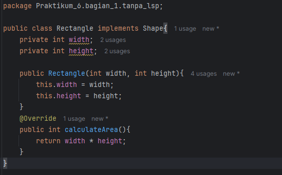

Buat class Square dan isikan kode berikut:

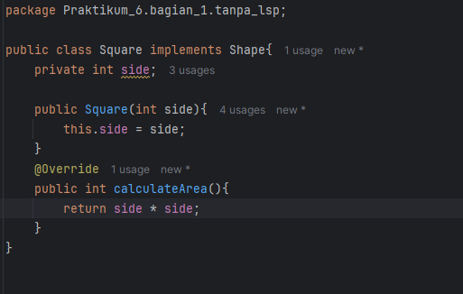

Buat class Main dan isikan kode berikut:

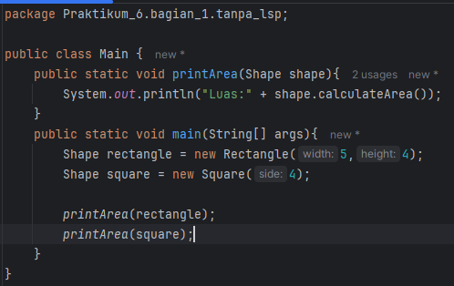

Jalankan dan lihat hasilnya.

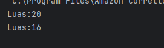

##### Refactor kode di atas untuk mematuhi aturan LSP
Buat sebuah package baru di dalam praktikum_1 dan beri nama dengan_lsp
Buat sebuah interface dengan nama Shape dan isikan kode berikut:

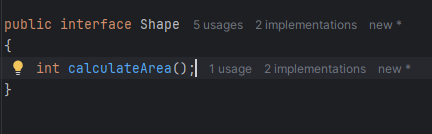

Buat sebuah class dengan nama Rectangle dan isikan kode berikut:

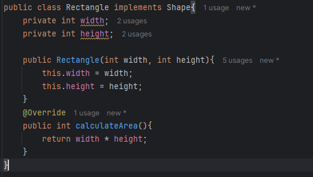

Buat sebuah class dengan nama Square dan isikan kode berikut:

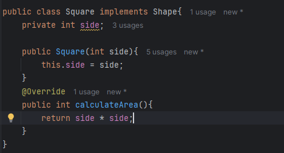

Buat sebuah class Main dan isikan kode berikut:

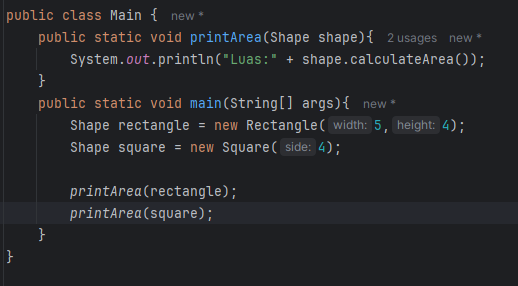

Jalankan dan lihat hasilnya.

---
#### bagian 2 : 
##### Kode yang melanggar aturan LSP
Buat sebuah package baru di dalam modul_6 dan beri nama praktikum_2
Buat sebuah package baru di dalam praktikum_2 dan beri nama tanpa_lsp
Buat class baru di dalam tanpa_lsp dengan nama SocialMediaPost dan isikan kode seperti berikut:

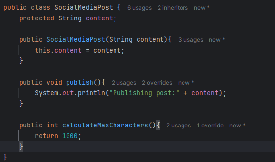

Buat class TwitterPost dan isikan kode berikut:

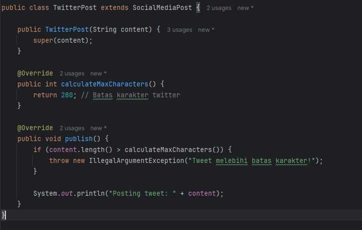

Buat class BlogPost dan isikan kode berikut:

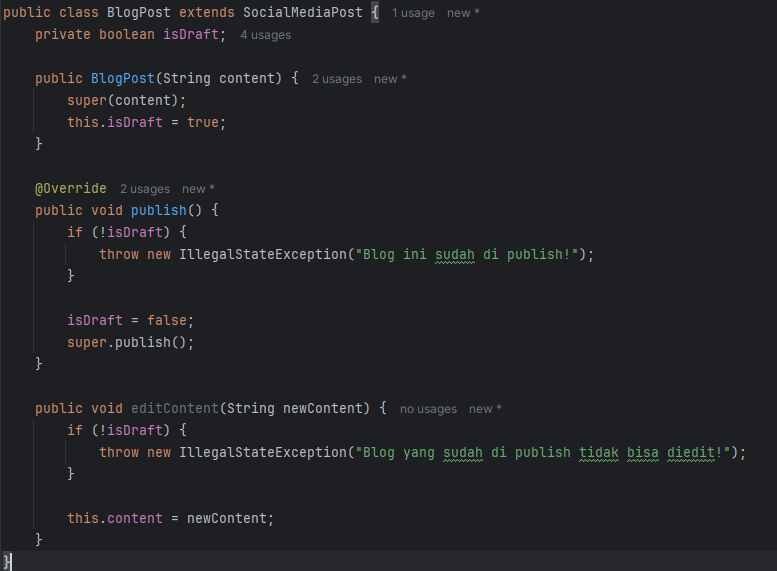

Buat class Main dan isikan kode berikut:

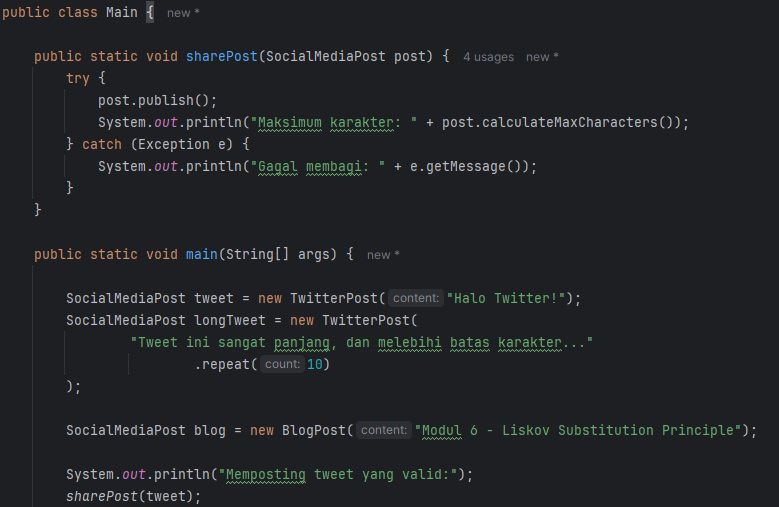
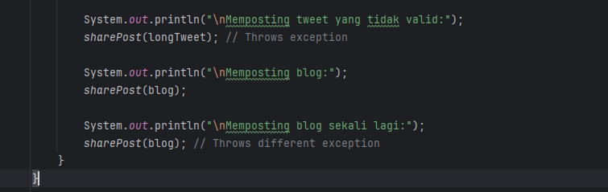

Jalankan dan lihat hasilnya.

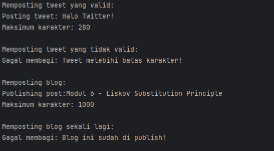
##### Refactor kode di atas untuk mematuhi aturan LSP
Buat sebuah package baru di dalam praktikum_2 dan beri nama dengan_lsp
Buat sebuah interface dengan nama Publishable dan isikan kode berikut:

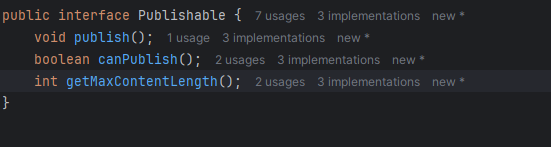

Buat sebuah class dengan nama SocialPost dan isikan kode berikut:

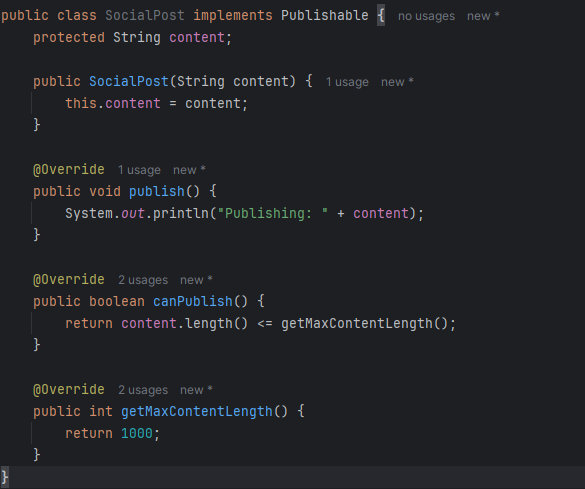

Buat sebuah class dengan nama TwitterPost dan isikan kode berikut:

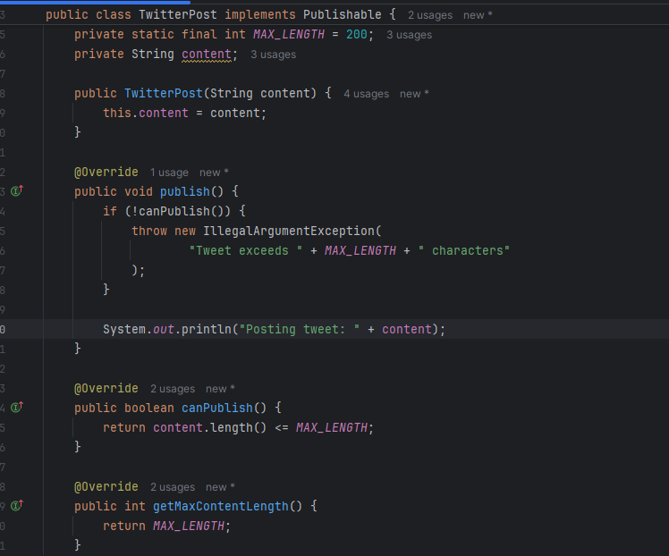

Buat sebuah class dengan nama BlogPost dan isikan kode berikut:

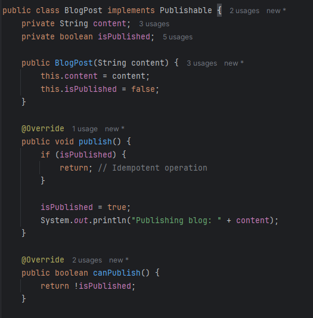
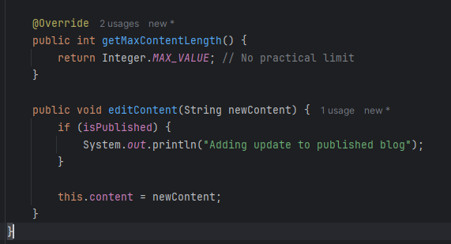

Buat sebuah class Main dan isikan kode berikut:

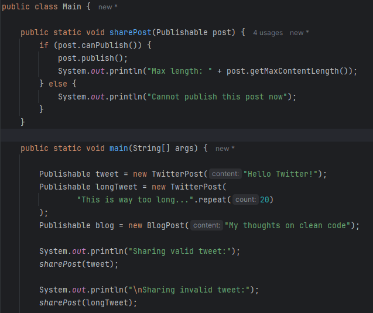
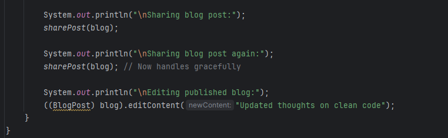

Jalankan dan lihat hasilnya.

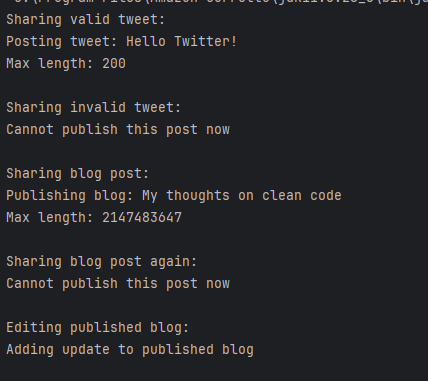
---

### Latihan : 
##### Kode yang melanggar aturan LSP
Pada program ini, kita akan membuat sebuah sistem navigasi di mana beberapa kendaraan tidak dapat mengimplementasikan kontrak dari kelas dasar dengan benar. Kode program dibawah ini melanggar aturan lsp.

Class Vehicle

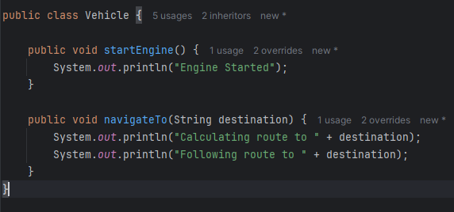

Class Car

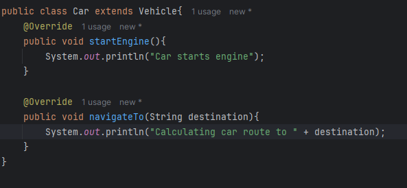

Class Bicycle

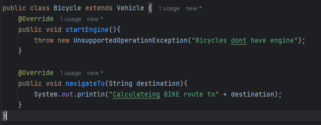

Class Main

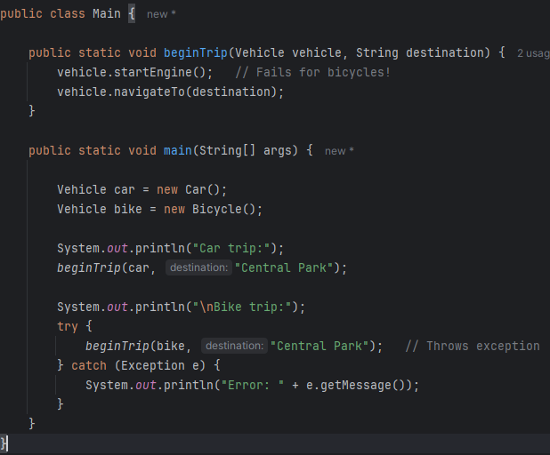

##### Refactor kode di atas untuk mematuhi aturan LSP

---

### Praktikum Strategy pattern
#### bagian 1 :
Praktikum 1 : Program Navigasi Sederhana
Use Case
Aplikasi navigasi bisa menggunakan berbagai strategi rute: jalan kaki, berkendara, atau transportasi umum.

Langkah Praktikum
Buat sebuah package baru di dalam modul_9 dan beri nama praktikum_2
Kemudian buat sebuah interface FilterStrategy dan isikan kode berikut:

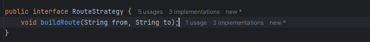

Buat class WalkingRoute dan isikan kode berikut:

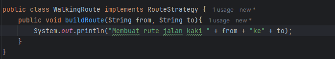

Buat class DrivingRoute dan isikan kode berikut:

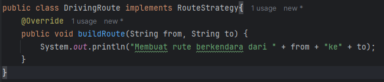

Buat class PublicTransportRoute dan isikan kode berikut:

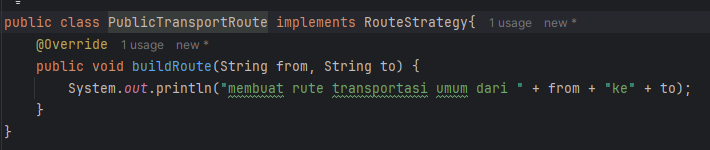

Buat class Navigator dan isikan kode berikut:

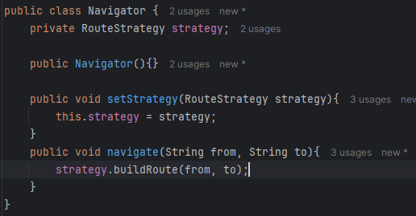

Buat class Main dan isikan kode berikut:

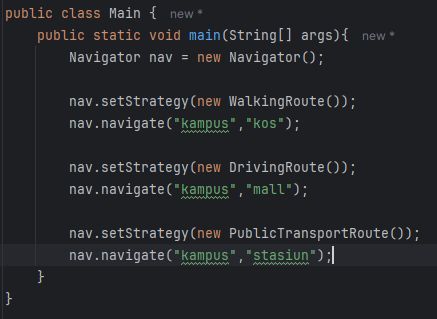

---
#### bagian 2 :
Praktikum 2 : Program Filter Foto Sederhana
Use Case
Aplikasi editing foto menyediakan berbagai filter: hitam-putih, sephia, dan cerah. Pengguna dapat memilih filter saat runtime.

Langkah Praktikum
Buat sebuah package baru di dalam modul_9 dan beri nama praktikum_2
Kemudian buat sebuah interface FilterStrategy dan isikan kode berikut:

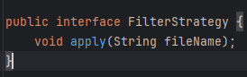

Buat class BlackWhiteFilter dan isikan kode berikut:

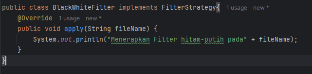

Buat class SepiaFilter dan isikan kode berikut:

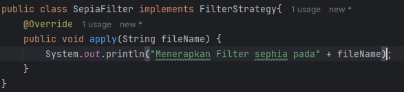

Buat class BrightFilter dan isikan kode berikut:

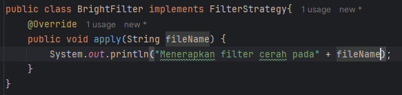

Buat class PhotoEditor dan isikan kode berikut:

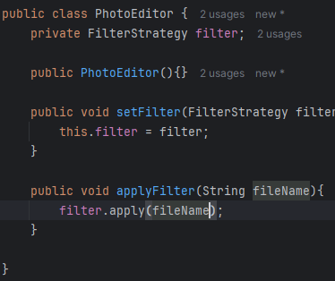

Buat class Main dan isikan kode berikut:

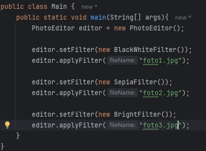

---

#### Bagian 3 :
Praktikum 3 : Program Notifikasi
Use Case
Sistem dapat mengirim notifikasi dengan berbagai cara tergantung situasi pengguna: email, SMS, atau push.

Langkah Praktikum
Buat sebuah package baru di dalam modul_9 dan beri nama praktikum_3
Kemudian buat sebuah interface NotificationStrategy dan isikan kode berikut:

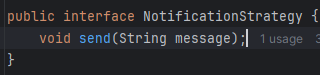

Buat class EmailNotification dan isikan kode berikut:

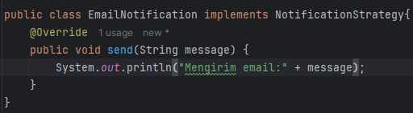

Buat class SMSNotification dan isikan kode berikut:

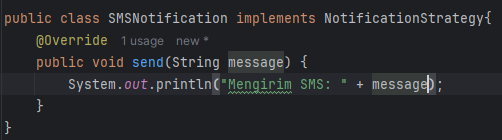

Buat class PushNotification dan isikan kode berikut:

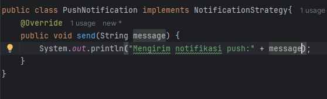

Buat class NotificationService dan isikan kode berikut:

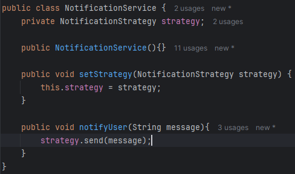

Buat class Main dan isikan kode berikut:

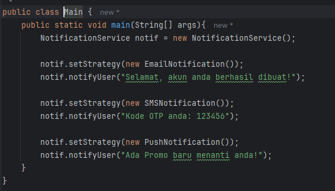

### Latihan :Program Pembayaran E-Commerce (Strategy Pattern)
Deskripsi:
Anda diminta untuk mengembangkan sistem checkout sederhana yang mendukung tiga jenis metode pembayaran:

Kartu Kredit

E-Wallet

Transfer Bank

Tugas Praktikum:
Buat interface PaymentStrategy dengan method pay(double amount).
Buat tiga class yang mengimplementasikan PaymentStrategy yaitu: CreditCardPayment, EWalletPayment, dan BankTransferPayment.
Buat class Checkout(Contex Class) yang menggunakan PaymentStrategy.
Di dalam main, tunjukkan contoh penggunaan masing-masing metode pembayaran.
Langkah Praktikum
Buat sebuah package baru di dalam Praktikum_7 dan beri nama latihan
Kemudian buat sebuah interface PaymentStrategy dan isikan kode berikut:

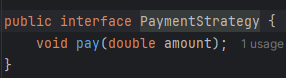

Buat class CreditCarPayment dan isikan kode berikut:

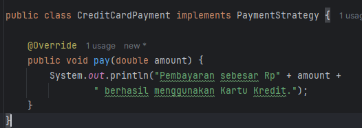

Buat class EwalletPayment dan isikan kode berikut:

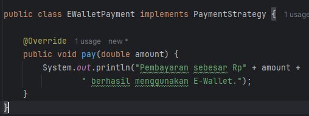

Buat class BankTransferPayment dan isikan kode berikut:

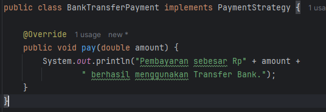

Buat class CheckOut dan isikan kode berikut:

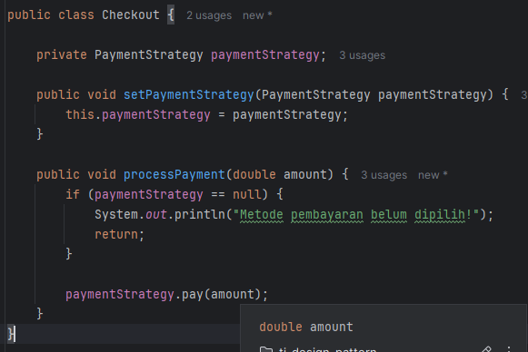

Buat class Main dan isikan kode berikut:

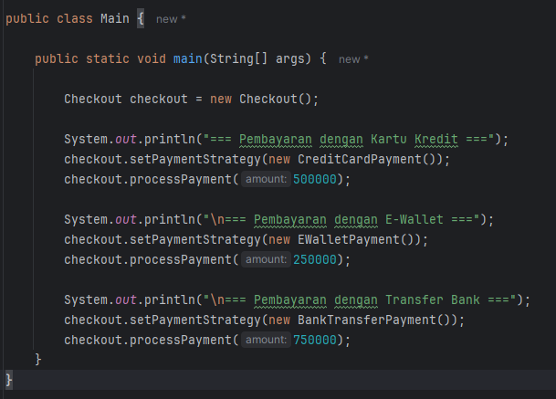

## Tugas Analisis:
1. Jelaskan mengapa Strategy Pattern cocok digunakan dalam kasus pembayaran e-commerce.
2. Bagaimana jika suatu hari ingin menambahkan metode pembayaran baru seperti QRIS? Apakah Anda perlu mengubah class Checkout?

## Jawaban Tugas Analisis

### Soal 1
Jelaskan mengapa Strategy Pattern cocok digunakan dalam kasus pembayaran e-commerce.

### Jawaban:
Strategy Pattern cocok digunakan dalam kasus pembayaran e-commerce karena terdapat berbagai metode pembayaran yang memiliki proses berbeda-beda, seperti Kartu Kredit, E-Wallet, dan Transfer Bank.

Dengan menggunakan Strategy Pattern, setiap metode pembayaran dibuat dalam class terpisah yang mengimplementasikan interface yang sama, yaitu PaymentStrategy. Hal ini membuat sistem lebih fleksibel karena metode pembayaran dapat diganti saat runtime tanpa mengubah kode utama.

Keuntungan lainnya adalah:
- Mengurangi penggunaan if-else yang berlebihan.
- Mempermudah pemeliharaan kode.
- Mendukung prinsip Open/Closed Principle (OCP) karena sistem dapat diperluas tanpa memodifikasi kode yang sudah ada.

---

### Soal 2
Bagaimana jika suatu hari ingin menambahkan metode pembayaran baru seperti QRIS? Apakah Anda perlu mengubah class Checkout?

### Jawaban:
Tidak perlu mengubah class Checkout.

Untuk menambahkan metode pembayaran QRIS, cukup membuat class baru yang mengimplementasikan interface PaymentStrategy.

## Kesimpulan
Berdasarkan praktikum yang telah dilakukan, dapat disimpulkan bahwa Liskov Substitution Principle (LSP) membantu memastikan bahwa hubungan pewarisan dalam program tetap konsisten dan tidak menimbulkan perilaku yang tidak diharapkan. Dengan menerapkan LSP, desain perangkat lunak menjadi lebih stabil dan mudah dipelihara.

Selain itu, Strategy Pattern memungkinkan pemisahan algoritma ke dalam kelas-kelas yang independen sehingga algoritma dapat dipilih dan diganti secara fleksibel saat runtime. Pola ini sangat bermanfaat dalam membangun sistem yang mudah dikembangkan dan mendukung prinsip-prinsip SOLID.

## penutup
Demikian laporan praktikum mengenai penerapan Liskov Substitution Principle (LSP) dan Strategy Pattern. Melalui praktikum ini diperoleh pemahaman mengenai pentingnya desain perangkat lunak yang baik dalam menghasilkan sistem yang fleksibel, mudah dikembangkan, dan mudah dipelihara. Diharapkan konsep-konsep yang telah dipelajari dapat diterapkan dalam pengembangan perangkat lunak pada proyek yang lebih kompleks di masa mendatang.
